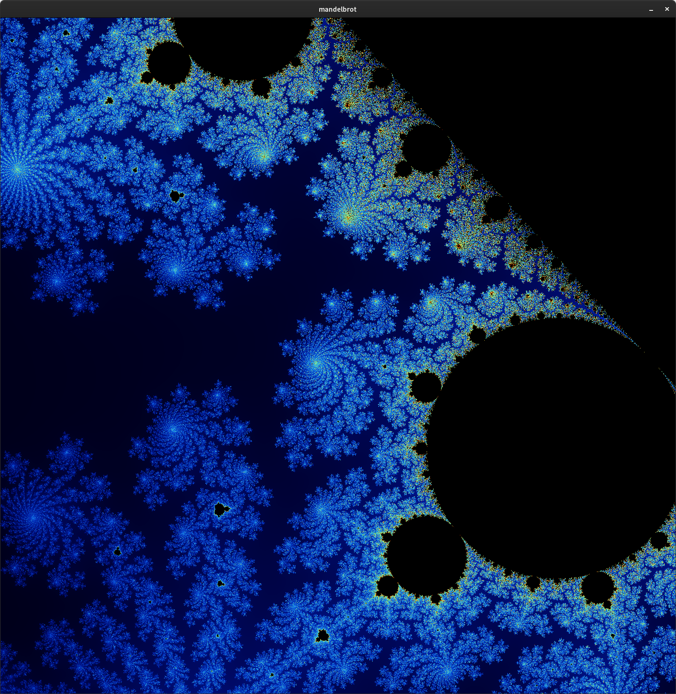
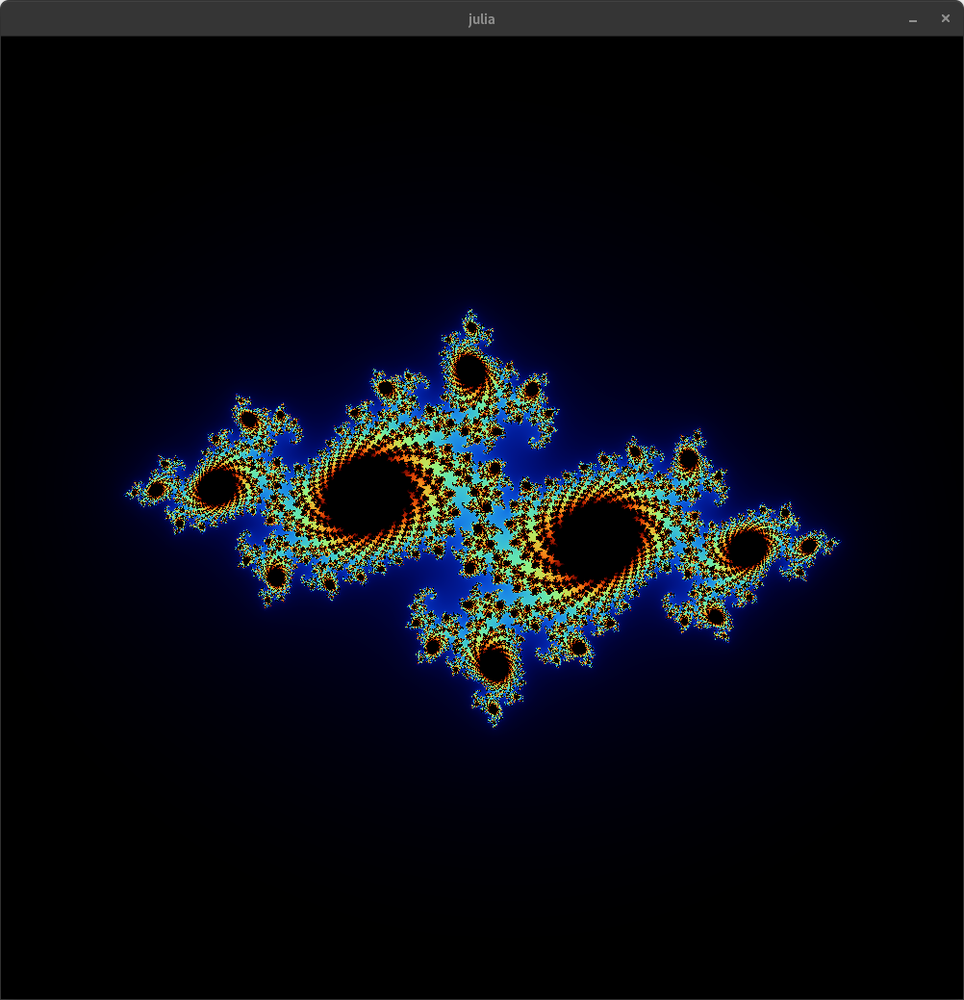
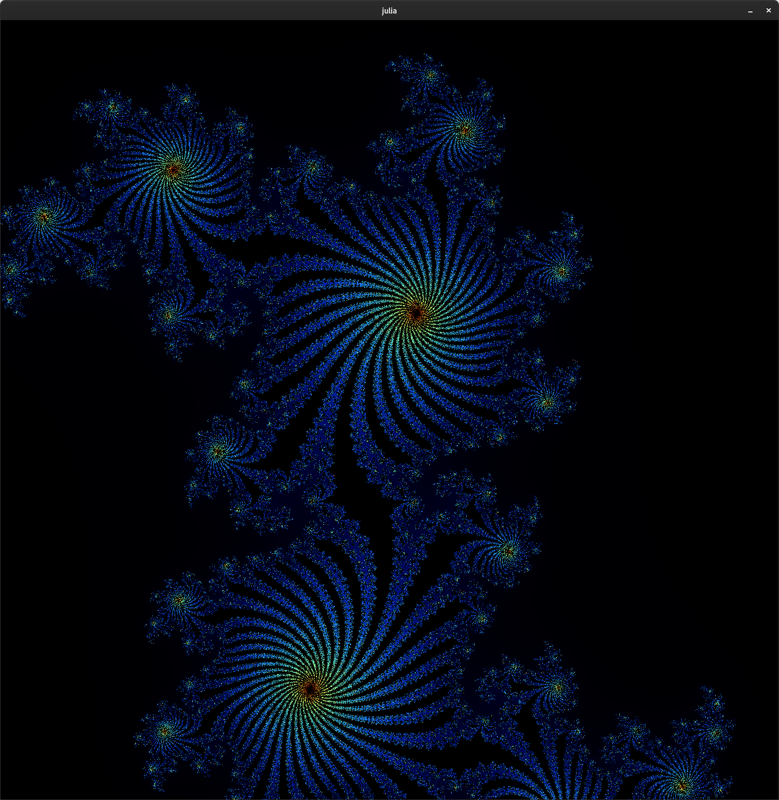
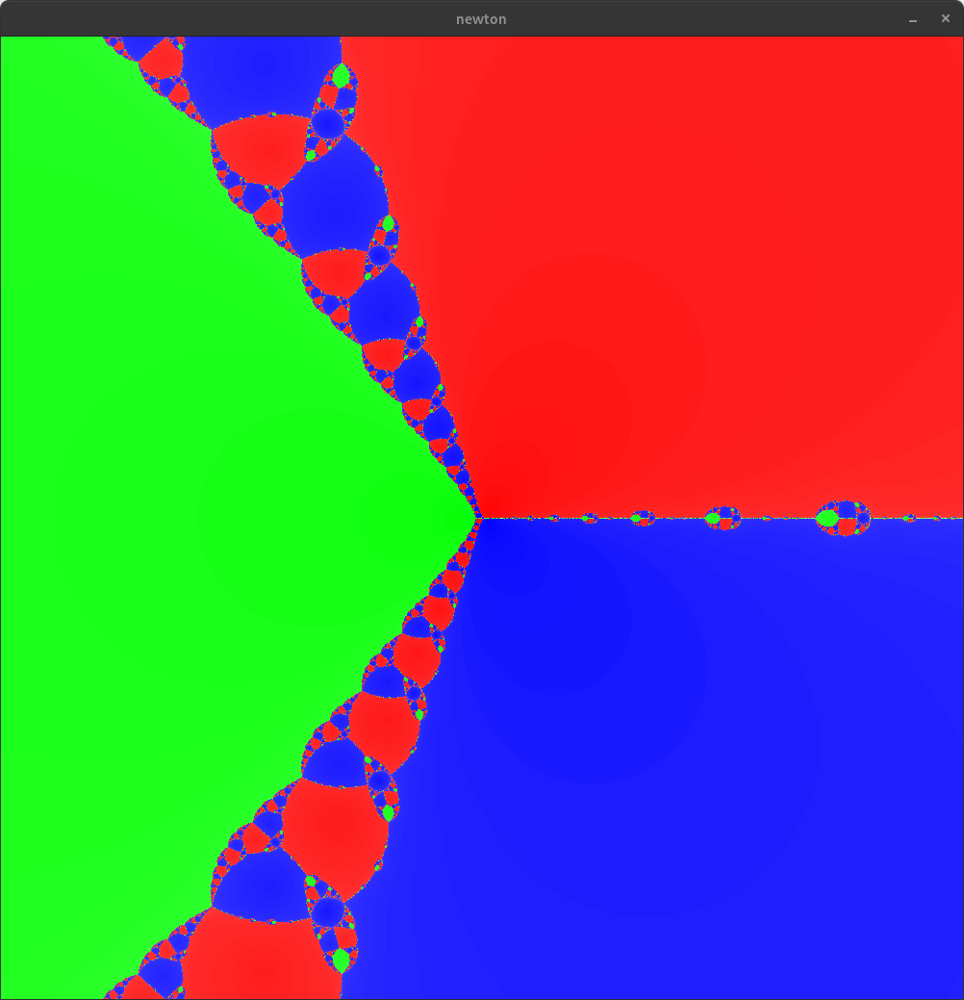
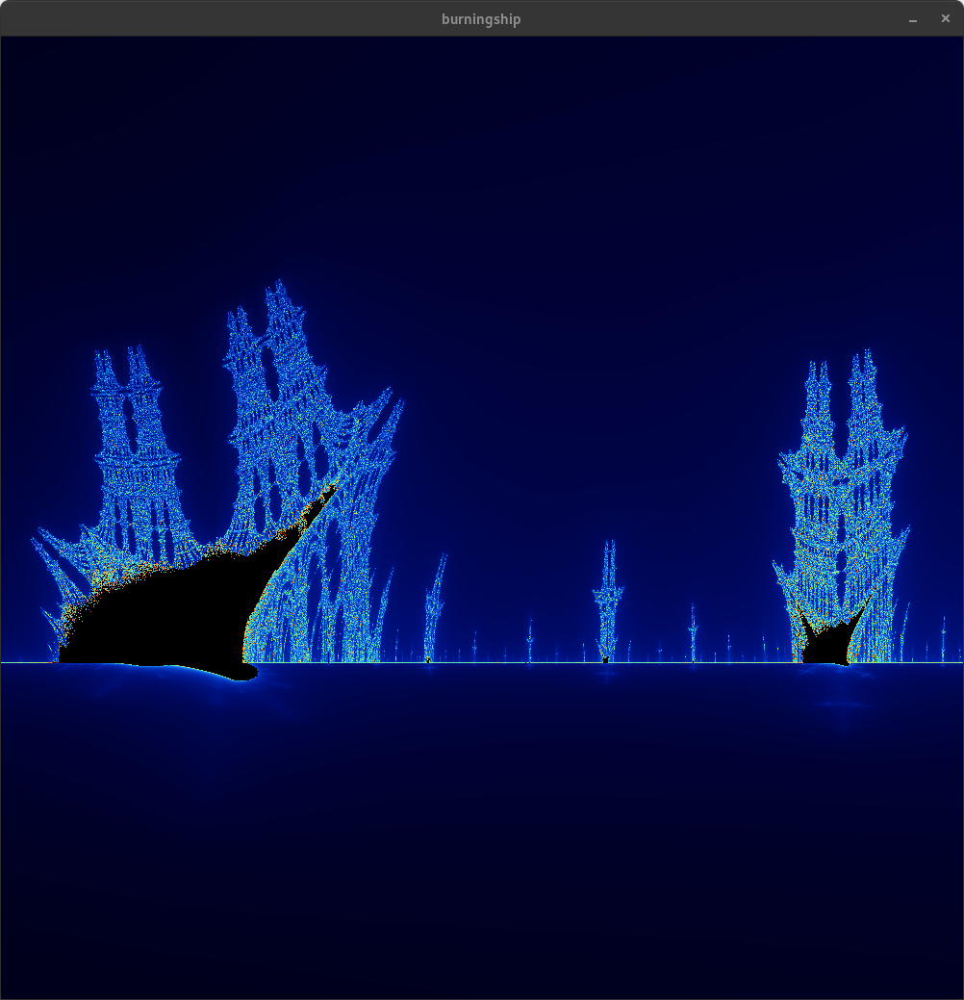
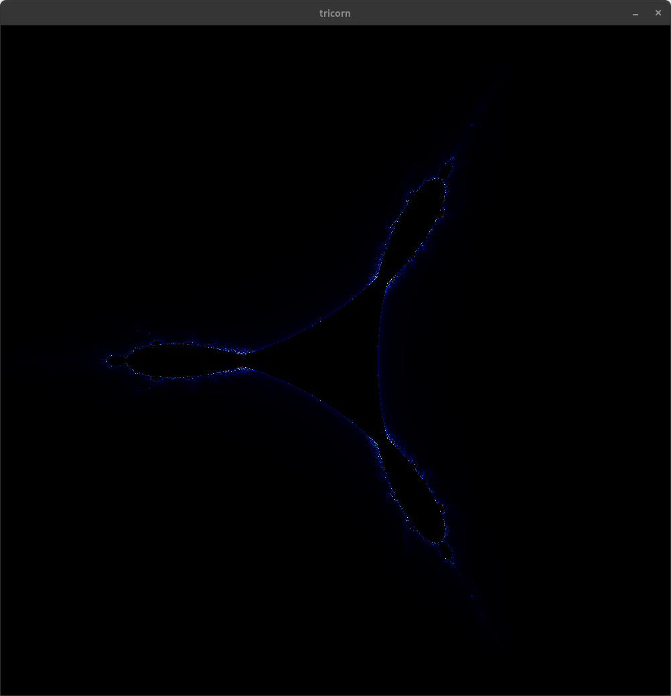

# FRACT-OL
It’s time for you to create a basic computer graphics project!
You will use the school’s graphical library, the MiniLibX. This library was developed
internally and includes basic necessary tools to open a window, create images and deal
with keyboard and mouse events.
This will be an opportunity for you to become familiar with the MiniLibX library, dis-
cover or use the mathematical concept of complex numbers, explore computer graphics
optimization, and practice event handling.

## USAGE
If you want to explore my project clone the repository with :

```sh
git clone git@github.com:maelgini/fract-ol.git
```

Then situate yourself inside the repo :

```sh
cd fract-ol
```

Access the lib/ folder then minilibx-linux/ and make inside of it :

```sh cd lib/minilibx-linux/
make
```

Go back to the root of the folder and make

```sh
cd ..
cd ..
make
```

The binary will automatically be placed in bin/
To run the program, do :

```sh
bin/fractol <mandelbrot/tricorn/burningship/newton>
```

or

```sh
bin/fractol <julia> <double x> <double y>
```

(The julia fractal will always need 2 more arguments, these 2 double values will be the coordinates of the point inside the mandelbrot set you want to display as a Julia set)
## SCREENSHOTS







## BREAKDOWN

### Foreword
First of all if you are not familiar with iterative functions I suggest you take a look at this article if not already done : https://en.wikipedia.org/wiki/Mandelbrot_set

It can get kind of overwhelming to represent this by coding it but this is easier than it looks.

It's good to make a performant and good-looking program but this project is a true RABBIT HOLE so be careful about the time you spend doing additionnal things.

I personally enjoyed this project a lot hope you will too and good luck!

### MINILIBX & EVENTS HANDLING

You should start by going around the library and browse functions that seem useful.

There is a specific order of function calls to get a proper manipulable window that can display pixels correctly, Try to browse the library and understand which order makes the most sense, Same thing when you are finished with the display and want to close everything.

Also DO NOT forget to initialize everything correctly to avoid conditionnal jumps depending of uninitialised values, AND free everything when you are done with display, You don't necessarily need memory allocation for this project this is the only way you can get leaks.

There are a lot of useful functions inside this given library, It will facilitate the work highly. First of all you will have to use mlx_hook(), mlx_mouse_hook() and mlx_loop() their purpose together are to keep listening to events as long as your program is running and return a specific code to help you handle the bonuses easily.

All different possible inputs have a respective X11 symbol code (), That's what I used to identify which input is activated while the program is running.

To understand it a bit better you can printf "keysym" (Don't forget to include the library!) with %s to visualise the triggered code for each key.

Summary of events : Check the code symbol of each useful key and bound an action to it in a small lexer, Example pseudo codes : If keysym returned is Escape code, then close all and free cleanly // If keysym returned is a directionnal arrow code, offset your fractal accordingly etc.

### FORMULA

$Z_{n+1} = Z_n^2 + c$. This formula is iterated on the complex plane, which means that we will use complex numbers as our y axis and reals on the x axis, This is what makes this set particular and so unique.

When you chose a point on your complex plain and iterate this function you can get different behaviors :

It either diverges (the iteration of the chosen point by the formula makes it quickly or slowly branch off of the plane depending on how close it is to the figure)

Or it can converge inside the fractal and stay inside it almost infinetely (limited by the machine).

A good information I can give is that a coordinate can be seen an hypotenuse, as any coordinate form a right triangle on a plane, their position's hypotenuse can be seen as having a lenght, and in this particular case of the mandelbrot set, an interesting observation is that if the coordinate triangle's sides are both of length 2 at least; it is recurrently always outside the set, So you can implement a quick few lines of code stating that if any coordinate's hypotenuse is 4 then it's automatically diverging which can be useful for optimization.

Given this I started to build a structure containing complex and real numbers to manipulate them.

After you have a strong mlx display implementation each pixel is handlable easily and derivable using the mandelbrot formula also apply your color algorithm to it.

### BONUS FRACTALS


### COLOR ALGORITHM

One of the most import part of the project is the color management because it is what gives that depth impression to your rendering, It it mandatory to set colors to be different for each iteration of your fractal, I decided to implement a linear interpolation ([Wikipedia link](https://en.wikipedia.org/wiki/Plotting_algorithms_for_the_Mandelbrot_set#Continuous_(smooth)_coloring))

$\phi(z) = \lim_{n \to \infty} (\log |z_n| / P^n)$.

to eliminate all color bandings and have a smooth gradient from black outside the set $(Z_{0})$ to blue then green then finally red, Its an RGB gradient respectively from $Z_{max}$ to $Z_{0}$ which is probably the best colorset to represent the depth of fractals (as you can see in the screenshots)


### THE NEWTON FRACTAL

Probably the most time consuming and worthless bonus possible, This fractal required root distance calcation, formula derivation and root aproximation codings, As all other fractals didnt require any hard coding.

The newton fractal's rendering can seem quite simplish and irrelevant but its significantly harder than all the other ones.

Formula : $p(z) = z^3 - 1$

Concept : Still on the complex plane, Regions of this plane $G_k$ all have associated roots of this polynoma, for this specific formula 3 roots are resulting. Almost all points of the complex plane are associated with one of the $\deg(p)$
roots of a given polynomial in the following way: the point is used as starting value $z_0$ for Newton's iteration $zn + 1 := zn − ⁠p(zn)/p'(zn)$, yielding a sequence of points $z_1$, $z_2$, …, If the sequence converges to the root $ζ_k$, then $z_0$ was an element of the region $G_k$. However, for every polynomial of degree at least 2 there are points for which the Newton iteration does not converge to any root: examples are the boundaries of the basins of attraction of the various roots. There are even polynomials for which open sets of starting points fail to converge to any root: a simple example is $z3 − 2z + 2$, where some points are attracted by the cycle 0, 1, 0, 1… rather than by a root.
